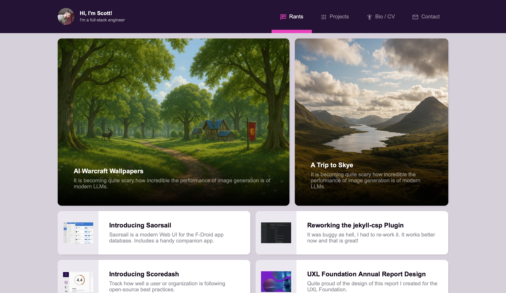

# strong.scot (personal website)

This project was generated using [Angular CLI](https://github.com/angular/angular-cli) version 19.0.6. This is my 
personal website. Although the code is MIT, you'll probably not finding closing this repo very interesting!

## Notes

- Blogs/rants are generated from [strong.scot-feed repo](https://github.com/scottstraughan/strong.scot-feed).

## Website

Please visit <https://strong.scot>.

## License

MIT
