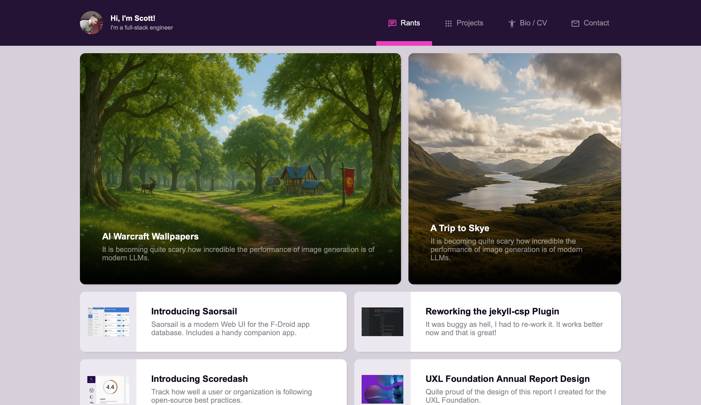

# strong.scot (personal website)

This project was generated using [Angular CLI](https://github.com/angular/angular-cli) version 19.0.6. This is my 
personal website. Although the code is MIT, you'll probably not finding closing this repo very interesting!

## Local Dev (ng serve)

Don't use `ng serve`, use `npm run serve` since we need generated files at run time.

## Website

Please visit <https://strong.scot>.

## License

MIT
